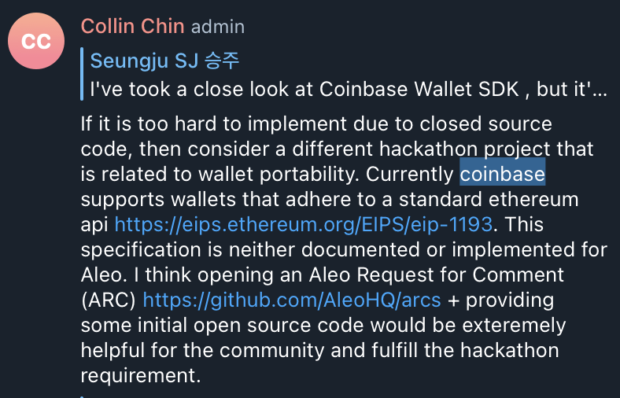
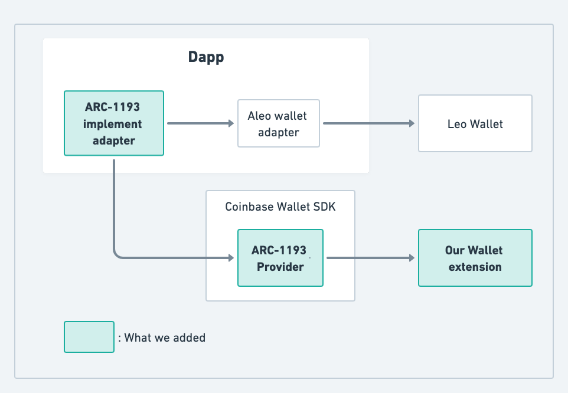
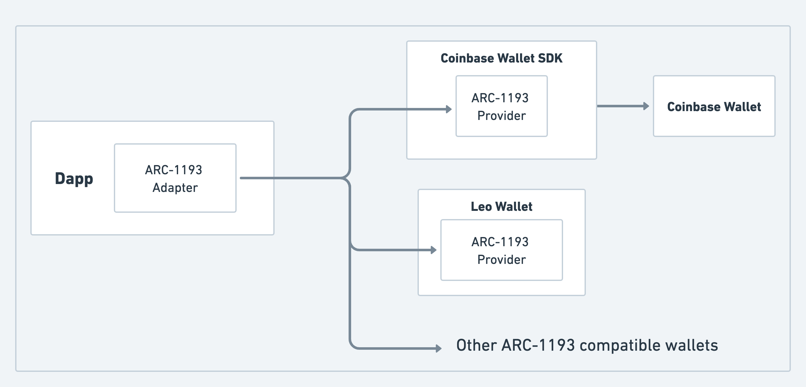

## Motivation





## Demo

https://user-images.githubusercontent.com/4685781/211352774-2625e0dd-867e-4536-b56c-28eb24308876.mov

[Presentation Deck](./Aleo.pdf)

## Implementations

[Aleo Dapp](https://github.com/mellowcroc/aleo-dapp)
[Aleo wallet extension](https://github.com/mellowcroc/aleo-wallet-extension)

## Abstract

Currently, there is no standard way for Dapps to communicate with Wallet apps, which means that Dapps need to
create multiple adapters to communicate with different Wallet apps. This problem will get exponentially worse
as the number of Dapps and Wallets increase.

By formalizing Provider APIs that Wallet apps can expose to Dapps, we expect to increase wallet interoperability
and facilitate onboarding of existing Wallet apps onto the Aleo Dapp ecosystem.



## Specification

### Definitions

- Provider
  - A JavaScript object made **available to a consumer**, that provides access to Aleo by means of a Client.
- Client
  - An endpoint that **receives Remote Procedure Call (RPC) requests from the Provider**, and returns their results
- Wallet
  - An end-user application that manages private keys, performs signing operations, and acts as a **middleware between the Provider and the Client**
- RPC
  - any request **submitted to a Provider** for some procedure that is **to be processed by a Provider, its Wallet, or its Client**

### Connectivity

The Provider is said to be “connected” when it can service RPC requests to at least one chain

The Provider is said to be "disconnected" when it cannot service RPC requests to any chain at all.

> To service an RPC request, the Provider must successfully submit the request to the remote location, and receive a response. In other words, if the Provider is unable to communicate with its Client, for example due to network issues, the Provider is disconnected.\*\*\*\*

### API

> The Provider API is specified using TypeScript. The authors encourage implementers to declare their own types and interfaces, using the ones in this section as a basis.
>
> For consumer-facing API documentation, see Appendix I

The Provider **MUST** implement and expose the API defined in this section. All API entities **MUST** adhere to the types and interfaces defined in this section.

**request**

> The `request` method is intended as a transport- and protocol-agnostic wrapper function for Remote Procedure Calls (RPCs).

```tsx
interface RequestArguments {
  readonly method: string;
  readonly params?: readonly unknown[] | object;
}

Provider.request(args: RequestArguments): Promise<unknown>;
```

The Provider **MUST** identify the requested RPC method by the value of `RequestArguments.method`.

If the requested RPC method takes any parameters, the Provider **MUST** accept them as the value of `RequestArguments.params`.

RPC requests **MUST** be handled such that the returned Promise either resolves with a value per the requested RPC method's specification, or rejects with an error.

If resolved, the Promise **MUST** resolve with a result per the RPC method's specification. The Promise **MUST NOT** resolve with any RPC protocol-specific response objects, unless the RPC method's return type is so defined.

If the returned Promise rejects, it **MUST** reject with a `ProviderRpcError` as specified in the RPC Errors section below.

The returned Promise **MUST** reject if any of the following conditions are met:

- An error is returned for the RPC request.
  - If the returned error is compatible with the `ProviderRpcError` interface, the Promise **MAY** reject with that error directly.
- The Provider encounters an error or fails to process the request for any reason.

> If the Provider implements any kind of authorization logic, the authors recommend rejecting with a `4100` error in case of authorization failures.

The returned Promise **SHOULD** reject if any of the following conditions are met:

- The Provider is disconnected.
  - If rejecting for this reason, the Promise rejection error `code` **MUST** be `4900`.
- The RPC request is directed at a specific chain, and the Provider is not connected to that chain, but is connected to at least one other chain.
  - If rejecting for this reason, the Promise rejection error `code` **MUST** be `4901`.

See the section Connectivity for the definitions of "connected" and "disconnected".

### Supported RPC Methods

A "supported RPC method" is any RPC method that may be called via the Provider.

All supported RPC methods **MUST** be identified by unique strings.

Providers **MAY** support whatever RPC methods required to fulfill their purpose, standardized or otherwise.

If an RPC method defined in a finalized AIP is not supported, it **SHOULD** be rejected with a `4200` error per the **Provider Errors** section below, or an appropriate error per the RPC method's specification.

### RPC Errors

```tsx
interface ProviderRpcError extends Error {
  code: number;
  data?: unknown;
}
```

- `message`
  - **MUST** be a human-readable string
  - **SHOULD** adhere to the specifications in the **Error Standards** section below
- `code`
  - **MUST** be an integer number
  - **SHOULD** adhere to the specifications in the **Error Standards** section below
- `data`
  - **SHOULD** contain any other useful information about the error

### Error Standards

`ProviderRpcError` codes and messages **SHOULD** follow these conventions, in order of priority:

1. The errors in the **Provider Errors** section below
2. Any errors mandated by the erroring RPC method's specification
3. The `[CloseEvent` status codes](https://developer.mozilla.org/en-US/docs/Web/API/CloseEvent#Status_codes)

### Provider Errors

| Status code | Name                  | Description                                                              |
| ----------- | --------------------- | ------------------------------------------------------------------------ |
| 4001        | User Rejected Request | The user rejected the request.                                           |
| 4100        | Unauthorized          | The requested method and/or account has not been authorized by the user. |
| 4200        | Unsupported Method    | The Provider does not support the requested method.                      |
| 4900        | Disconnected          | The Provider is disconnected from all chains.                            |
| 4901        | Chain Disconnected    | The Provider is not connected to the requested chain.                    |

> 4900 is intended to indicate that the Provider is disconnected from all chains, while 4901 is intended to indicate that the Provider is disconnected from a specific chain only. In other words, 4901 implies that the Provider is connected to other chains, just not the requested one.

## Events

The Provider **MUST** implement the following event handling methods:

- `on`
- `removeListener`

These methods **MUST** be implemented per the Node.js `[EventEmitter` API](https://nodejs.org/api/events.html).

> To satisfy these requirements, Provider implementers should consider simply extending the Node.js EventEmitter class and bundling it for the target environment.

### message

> The message event is intended for arbitrary notifications not covered by other events.

When emitted, the `message` event **MUST** be emitted with an object argument of the following form:

```tsx
interface ProviderMessage {
  readonly type: string;
  readonly data: unknown;
}
```

### connect

See the section **Connectivity** for the definition of "connected".

If the Provider becomes connected, the Provider **MUST** emit the event named `connect`.

This includes when:

- The Provider first connects to a chain after initialization.
- The Provider connects to a chain after the `disconnect` event was emitted.

This event **MUST** be emitted with an object of the following form:

```tsx
interface ProviderConnectInfo {
  readonly decryptPermission: string;
  readonly chainId: string;
}
```

`chainId` **MUST** specify the integer ID of the connected chain as a hexadecimal string.

### disconnect

See the section **Connectivity** for the definition of "disconnected".

If the Provider becomes disconnected from all chains, the Provider **MUST** emit the event named `disconnect` with value `error: ProviderRpcError`, per the interfaced defined in the **RPC Errors** section. The value of the error's `code` property **MUST** follow the [status codes for `CloseEvent`](https://developer.mozilla.org/en-US/docs/Web/API/CloseEvent#Status_codes).

### chainChanged

If the chain the Provider is connected to changes, the Provider **MUST** emit the event named `chainChanged` with value `chainId: string`, specifying the integer ID of the new chain as a hexadecimal string.

### accountsChanged

If the accounts available to the Provider change, the Provider **MUST** emit the event named `accountsChanged` with value `accounts: string[]`.

### Test Cases

Tests need to be implemented by Wallet apps so that the above specifications works as expected.

## Reference Implementations (Dapps)

### request

Makes an Aleo RPC method call.

```tsx
interface RequestArguments {
  readonly method: string;
  readonly params?: readonly unknown[] | object;
}

Provider.request(args: RequestArguments): Promise<unknown>;
```

The returned Promise resolves with the method's result or rejects with a `ProviderRpcError`. For example:

```tsx
Provider.request({ method: "aleo_accounts" })
  .then((accounts) => console.log(accounts))
  .catch((error) => console.error(error));
```

### Events

Events follow the conventions of the Node.js `[EventEmitter` API](https://nodejs.org/api/events.html).

**connect**

The Provider emits `connect` when it:

- first connects to a chain after being initialized.
- first connects to a chain, after the `disconnect` event was emitted.

```tsx
interface ProviderConnectInfo {
  readonly decryptPermission: string;
  readonly chainId: string;
}

Provider.on('connect', listener: () => void): Provider;
```

**disconnect**

The Provider emits `disconnect` when it becomes disconnected.

```tsx
Provider.on('disconnect', listener: (error: ProviderRpcError) => void): Provider;
```

This event emits a `ProviderRpcError`. The error `code` follows the table of `[CloseEvent` status codes](https://developer.mozilla.org/en-US/docs/Web/API/CloseEvent#Status_codes).

**accountsChanged**

The Provider emits `accountsChanged` if the accounts returned from the Provider change.

```tsx
Provider.on('accountsChanged', listener: (accounts: string[]) => void): Provider;
```

The event emits with `accounts`, an array of account addresses.

**message**

The Provider emits `message` to communicate arbitrary messages to the consumer. Messages may include JSON-RPC notifications, and/or any other event as defined by the Provider.

```tsx
interface ProviderMessage {
  readonly type: string;
  readonly data: unknown;
}

Provider.on('message', listener: (message: ProviderMessage) => void): Provider;
```

### Errors

```tsx
interface ProviderRpcError extends Error {
  message: string;
  code: number;
  data?: unknown;
}
```

## Dependencies

- Leo Wallet
- aleo-wallet-adapter

### Backwards Compatibility

## Security & Compliance

This provider should not handle any private key or account management functionality since it will be exposed to an
untrusted environment.

## References

We referenced [EIP-1193] heavily since it is a known and widely-used solution to this problem. Also, it will be
convenient for onboarding developers who are accustomed to Ethereum's interfaces.
